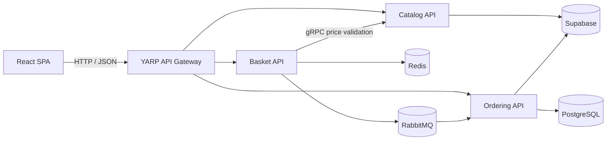
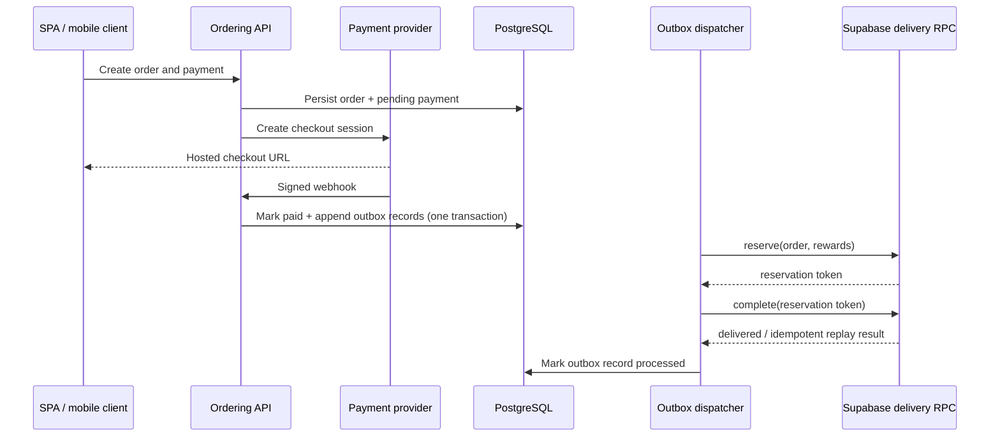

# GameShop

[](https://github.com/danielsarabuna/gameshop-dotnet/actions/workflows/ci.yml)
[](https://github.com/danielsarabuna/gameshop-dotnet/actions/workflows/codeql.yml)

GameShop is a backend-first .NET platform for selling in-game currency and subscriptions. It demonstrates service boundaries, authenticated checkout, provider-specific payment processing, transactional outbox delivery, idempotent webhooks, and versioned mobile purchase delivery.

The React SPA is a separate, replaceable client. It exercises the public HTTP contracts and provides a visual storefront, but the backend and its contracts are the primary focus of this repository.


## Architecture





### Engineering decisions

- .NET 10 LTS minimal APIs with explicit Catalog, Basket, Ordering, gateway, contracts, and building-block projects.
- YARP routes external traffic; Basket validates price and availability against Catalog over gRPC.
- PostgreSQL stores orders, payments, webhook idempotency records, promo codes, and transactional outbox messages.
- Redis and RabbitMQ are optional local profile dependencies; in-memory/null adapters keep focused development loops small.
- Payment webhooks fail closed: unknown, unconfigured, unauthenticated, and unsupported verification paths cannot mutate an order.
- Supabase purchase delivery uses an idempotent `reserve -> complete` protocol drained from the outbox.
- Central package management, recommended .NET analyzers, deterministic builds, and CI warnings-as-errors keep projects consistent.
- OpenTelemetry traces, metrics, structured logs, health endpoints, rate limiting, and security headers are wired into the services.

## Repository layout

```text
src/
  ApiGateway/WebShop.ApiGateway/       YARP edge service
  BuildingBlocks/                      auth, errors, events, logging/telemetry
  Contracts/                           gRPC and integration-event contracts
  Services/Catalog.API/                catalog, player resolution, Supabase adapter
  Services/Basket.API/                 basket storage and server-side price validation
  Services/Ordering/                   domain, application, infrastructure, HTTP API
  WebApps/Shopping.Web/                standalone React/Vite storefront
tests/
  Ordering.Domain.Tests/               domain and application tests
  Catalog.API.Tests/                   catalog unit tests
  WebShop.IntegrationTests/            HTTP, gRPC, security, delivery, PostgreSQL tests
infra/keycloak/                        optional local OIDC realm
supabase/migrations/                   purchase-delivery database contracts
```

## Prerequisites

- .NET SDK 10.0.401 (the repository pins the 10.0.4xx feature band in `global.json`)
- Node.js 22 and npm
- Docker with Compose v2
- OpenSSL and `rg` for `make local-init`
- A Supabase development project for the remote catalog and end-to-end purchase delivery

## Environment configuration

Every `.env` variant is ignored. Never commit an environment file, provider credential, Supabase service-role key, JWT private key, or generated secret.

`make local-init` creates `.env.local` without relying on a tracked template. It supplies local-only PostgreSQL defaults, generates the RSA key pair and cache-invalidation secret, and leaves external credentials empty.

### Local variables

| Variable | Required | Purpose |
| --- | --- | --- |
| `POSTGRES_USER`, `POSTGRES_PASSWORD`, `POSTGRES_DB` | Generated defaults | Local Ordering database |
| `SUPABASE_URL` | Full flow | Supabase project URL |
| `SUPABASE_SERVICE_ROLE_KEY` | Full flow | Server-only catalog and delivery access |
| `SUPABASE_DB_URL` | Migrations only | Operator connection used by schema scripts |
| `CATALOG_BUCKET` | No | Catalog storage bucket; defaults to `dev` |
| `CATALOG_CACHE_INVALIDATION_SECRET` | Generated | HMAC secret for trusted cache invalidation |
| `GAME_TICKET_JWT_PRIVATE_KEY_PEM_BASE64` | Generated | Catalog-only ticket signing key |
| `GAME_TICKET_JWT_PUBLIC_KEY_PEM_BASE64` | Generated | Gateway/service ticket verification key |
| `PAYMENTS_MOCK_ENABLED` | No | Enables the non-production mock provider |

Create the local file manually if you do not want to use `make local-init`:

```bash
umask 077
cat > .env.local <<'ENV'
POSTGRES_USER=webshop
POSTGRES_PASSWORD=webshop-local-only
POSTGRES_DB=ordering
SUPABASE_URL=
SUPABASE_SERVICE_ROLE_KEY=
SUPABASE_DB_URL=
CATALOG_BUCKET=dev
CATALOG_CACHE_INVALIDATION_SECRET=
GAME_TICKET_JWT_PRIVATE_KEY_PEM_BASE64=
GAME_TICKET_JWT_PUBLIC_KEY_PEM_BASE64=
PAYMENTS_MOCK_ENABLED=true
ENV
make local-init
```

### Production variables

| Variable | Required | Purpose |
| --- | --- | --- |
| `SHOP_DOMAIN` | Yes | Public storefront hostname |
| `POSTGRES_*`, `RABBITMQ_*` | Yes | Persistent service credentials |
| `KEYCLOAK_ADMIN`, `KEYCLOAK_ADMIN_PASSWORD` | Yes | Initial identity-provider administrator |
| `SUPABASE_URL`, `SUPABASE_SERVICE_ROLE_KEY` | Yes | Catalog and purchase delivery |
| `SUPABASE_DB_URL` | Operations | Migration/verification connection |
| `GAME_TICKET_JWT_*_PEM_BASE64` | Yes | Offline-generated asymmetric ticket keys |
| `CATALOG_BUCKET`, `CATALOG_CACHE_INVALIDATION_SECRET` | Yes | Catalog deployment and invalidation |
| `PAYMENTS_STRIPE_*` | Provider-specific | Stripe checkout and webhook verification |
| `PAYMENTS_YOOKASSA_*` | Provider-specific | YooKassa checkout and verification |
| `PAYMENTS_XSOLLA_*` | Provider-specific | Xsolla checkout and verification |
| `PAYMENTS_PAYPAL_*`, `PAYMENTS_CORVUSPAY_*` | Experimental only | Explicit opt-in and prototype credentials; leave disabled in production |

```bash
umask 077
cat > .env.prod <<'ENV'
SHOP_DOMAIN=shop.example.invalid
POSTGRES_USER=webshop
POSTGRES_PASSWORD=
POSTGRES_DB=ordering
RABBITMQ_USER=webshop
RABBITMQ_PASSWORD=
KEYCLOAK_ADMIN=admin
KEYCLOAK_ADMIN_PASSWORD=
SUPABASE_URL=
SUPABASE_SERVICE_ROLE_KEY=
SUPABASE_DB_URL=
GAME_TICKET_JWT_PRIVATE_KEY_PEM_BASE64=
GAME_TICKET_JWT_PUBLIC_KEY_PEM_BASE64=
CATALOG_BUCKET=prod
CATALOG_CACHE_INVALIDATION_SECRET=
PAYMENTS_STRIPE_SECRETKEY=
PAYMENTS_STRIPE_WEBHOOKSECRET=
PAYMENTS_YOOKASSA_SHOPID=
PAYMENTS_YOOKASSA_SECRETKEY=
PAYMENTS_XSOLLA_MERCHANTID=
PAYMENTS_XSOLLA_APIKEY=
PAYMENTS_XSOLLA_PROJECTID=
PAYMENTS_XSOLLA_WEBHOOKSECRET=
PAYMENTS_PAYPAL_ENABLED=false
PAYMENTS_PAYPAL_CLIENTID=
PAYMENTS_PAYPAL_CLIENTSECRET=
PAYMENTS_PAYPAL_WEBHOOKSECRET=
PAYMENTS_PAYPAL_MODE=live
PAYMENTS_CORVUSPAY_ENABLED=false
PAYMENTS_CORVUSPAY_STOREID=
PAYMENTS_CORVUSPAY_SECRETKEY=
PAYMENTS_CORVUSPAY_WEBHOOKSECRET=
ENV
```

Use a secret manager in a real deployment; the production snippet is a field checklist, not a recommendation to keep long-lived credentials in a file.

## Run locally

Focused Docker profile (SPA, gateway, Catalog, Ordering, PostgreSQL):

```bash
make local-init
# Add the Supabase URL and service-role key to .env.local for the full catalog flow.
make local-up
make local-doctor
```

Add Basket, Redis, RabbitMQ, Keycloak, and Jaeger:

```bash
make local-up-full
```

Stop the stack:

```bash
make local-down
```

For a process-based development loop, start the APIs in separate terminals:

```bash
dotnet run --project src/Services/Catalog.API
dotnet run --project src/Services/Basket.API
dotnet run --project src/Services/Ordering/Ordering.API
dotnet run --project src/ApiGateway/WebShop.ApiGateway
```

Then start the SPA:

```bash
cd src/WebApps/Shopping.Web
npm ci
npm run dev
```

The storefront is available at `http://localhost:5200`; the gateway listens at `http://localhost:5100`.

## OpenAPI and examples

OpenAPI is available only when each service runs in `Development`:

| Service | OpenAPI JSON | Interactive reference |
| --- | --- | --- |
| Catalog | `http://localhost:5101/openapi/v1.json` | `http://localhost:5101/scalar/v1` |
| Basket | `http://localhost:5102/openapi/v1.json` | `http://localhost:5102/scalar/v1` |
| Ordering | `http://localhost:5103/openapi/v1.json` | `http://localhost:5103/scalar/v1` |

```bash
curl --fail http://localhost:5101/health
curl --fail 'http://localhost:5101/api/v1/catalog/items?locale=en'
curl --fail http://localhost:5103/api/v1/payment-methods
```

Authenticated Basket and Ordering calls require a game-session or recipient-session bearer token issued by the Catalog authentication endpoints. The OpenAPI document is the authoritative request/response reference.

## Quality checks

```bash
dotnet restore WebShop.sln -p:NuGetAudit=true
dotnet build WebShop.sln -c Release --no-restore -m:1
dotnet test tests/Ordering.Domain.Tests/Ordering.Domain.Tests.csproj -c Release
dotnet test tests/Catalog.API.Tests/Catalog.API.Tests.csproj -c Release
dotnet test tests/WebShop.IntegrationTests/WebShop.IntegrationTests.csproj -c Release
REQUIRE_DOCKER_TESTS=true dotnet test tests/WebShop.IntegrationTests/WebShop.IntegrationTests.csproj -c Release --filter 'Category=Integration'
dotnet format WebShop.sln --verify-no-changes --no-restore
dotnet list WebShop.sln package --vulnerable --include-transitive
```

```bash
cd src/WebApps/Shopping.Web
npm ci
npm run build
npm audit --audit-level=high
npx playwright install chromium
npm run test:e2e
```

Run Gitleaks against the complete repository history before publishing:

```bash
gitleaks git --redact --verbose .
```

CI publishes Cobertura reports and enforces a 30% aggregate line-coverage no-regression floor. PostgreSQL tests may skip on a local machine without Docker, but CI and `REQUIRE_DOCKER_TESTS=true` fail when Docker is unavailable.

## Payment providers

| Provider | Status | Notes |
| --- | --- | --- |
| Mock | Development only | Enabled locally for deterministic checkout tests |
| Stripe | Supported | Hosted checkout and signed webhooks |
| YooKassa | Supported | Redirect checkout and source verification |
| Xsolla | Supported | Hosted checkout and provider-protocol signature verification |
| PayPal | Optional | Disabled by default; requires client credentials, webhook ID and explicit `PAYMENTS_PAYPAL_MODE=live` in production; webhook signatures are verified through PayPal |
| CorvusPay | Experimental | Disabled by default; requires `Payments:CorvusPay:Enabled=true`; webhook verification returns `501` and cannot update an order |

An experimental provider is not returned by `/api/v1/payment-methods` unless both its explicit opt-in flag and credentials are configured.

## Known limitations

- There is no hosted demo; the repository homepage intentionally remains unset.
- The full catalog and mobile purchase-delivery path requires a Supabase project and schema migrations.
- The default local profile uses a null event bus; use the full profile to exercise Redis/RabbitMQ infrastructure.
- CorvusPay remains a checkout prototype and is not production-ready.
- Coverage is an initial no-regression baseline, not a claim of exhaustive behavioral coverage.

## Local-only documentation

Internal planning notes, development workflow metadata, and extended documentation are intentionally kept only in each developer's working directory. They may contain environment-specific paths, transient working context, and unfinished notes that are not stable public contracts. The public sources of truth are this README, the code, API contracts, database migrations, and tests.
